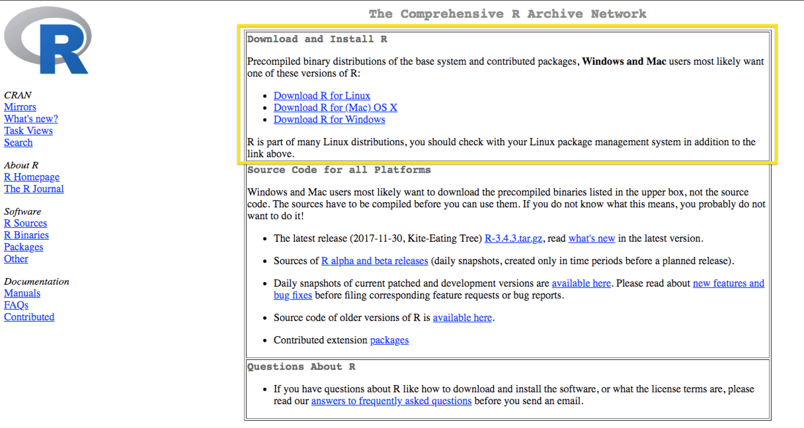
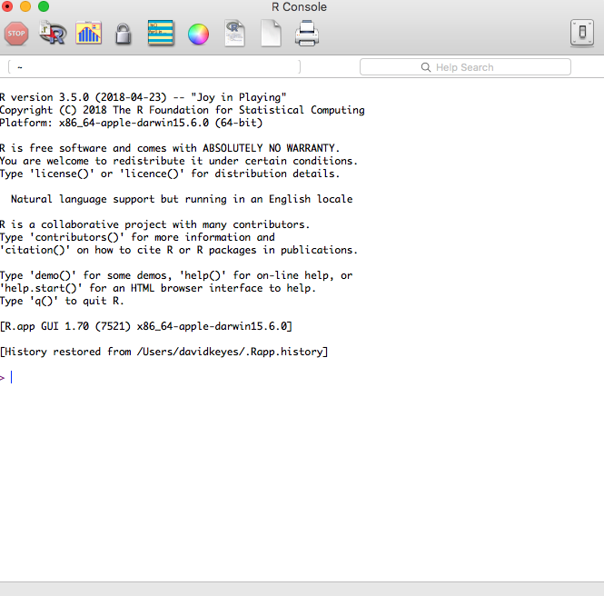
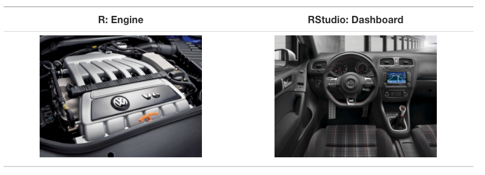
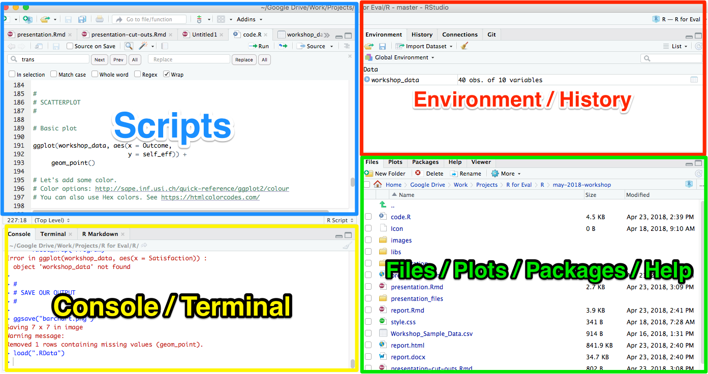
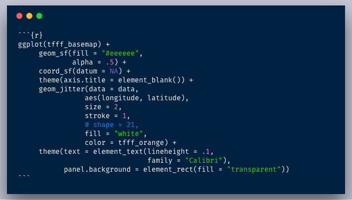
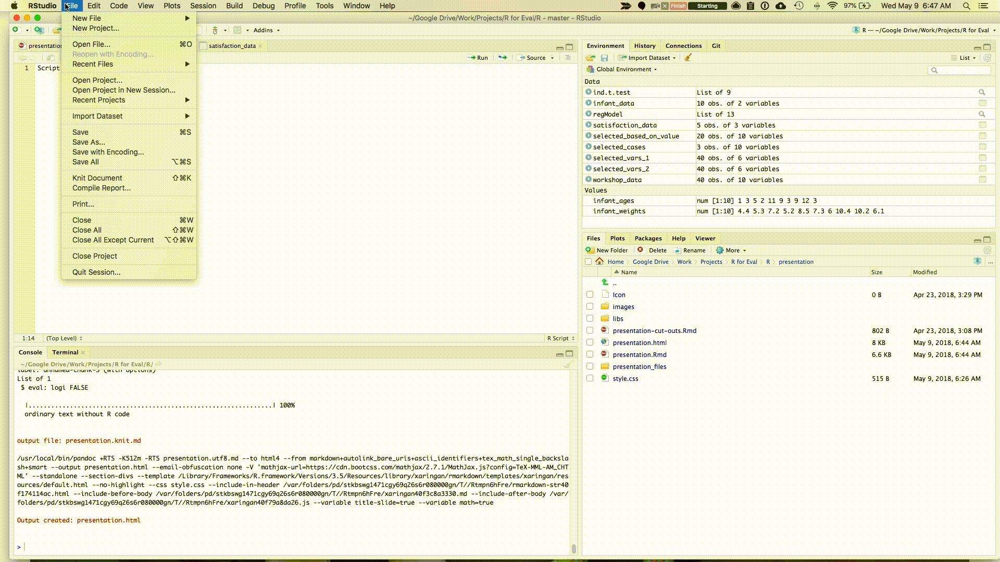
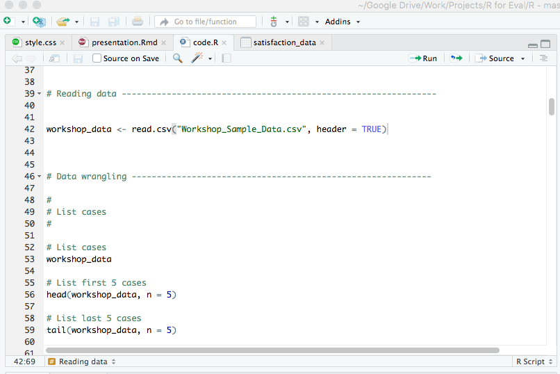
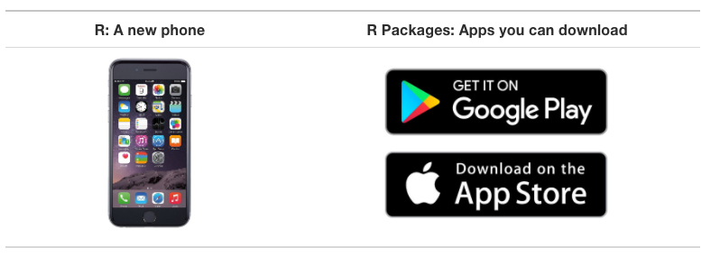

```{r child = "setup.Rmd"}
```


```{r packages, include = F, eval = T}


library(tidyverse)
library(skimr)
library(janitor)
library(DT)
library(here)
library(kableExtra)


```


class: inverse, middle, center

# Installation

---

## R

The first thing you need to do is download the R software. Go to the [Comprehensive R Archive Network (aka “CRAN”) website](https://cran.cnr.berkeley.edu/) and download the software for your operating system (Windows, Mac, or Linux).




---


### Working Directly in R




---

### Working Directly in R

1. Enter: 2 + 2

2. Hit return

3. View result

---

class:inverse

### Your Turn

1. Download and Install R

1. Open R

1. Use any mathematical operators (+, -, /, and *) to create an expression and make sure it works as expected


---


## RStudio

--

.center[


.small[Courtesy [Modern Dive](http://moderndive.com/2-getting-started.html#what-are-r-and-rstudio)]
]

---

### Tour of RStudio




---

class:inverse

### Your Turn

1. Download and Install RStudio

1. Open RStudio

1. Working in the console pane, use any mathematical operators (+, -, /, and *) to create an expression and make sure it works as expected


---

# Projects

--

Projects allow you to keep a collection of files all together, including: 

--

- R scripts

--

- RMarkdown files (more on those soon)

--

- Data files

--

- And much more!


---

## Sample Project


---


## How to Create a Project


1. File -> New Project

2. Quit RStudio, Double-click .Rproj file to reopen project

---

class:inverse

## Your Turn

1. Create a new project (doesn't matter if it's in a new or existing directory)

2. Quit RStudio, double-click the .Rproj file and reopen your project


---

# Download Course Project


---


# Two File Types

There are two main file types that you'll work with: 

.pull-left[
**R scripts (.R)**

Text is assumed to be executable R code unless you comment it (more on this soon)

```{r}

# This is a comment

data <- read_csv("data.csv")

```
]

--

.pull-right[

**RMarkdown files (.Rmd)**

Text is assumed to be text unless you put it in a code chunk (more on this soon)




]


---

## R Scripts


Create new script file: File -> New File -> R Script



---


# How to Run Code

Run the code: control + enter on Windows,  command + enter on Mac keystrokes or use Run button



???

Note that you don't have to highlight code. 

You can just hit run anywhere on line to run code. 

---

# Comments

Do them for others, and for your future self. 

```{r eval = F}

# This is a comment. 
# You might write something like: examining my dataset 

head(data, n = 5)

```


---

# Packages

Packages add functionality that is not present in base R. 

They're where much of the power of R is found.

--

.center[


.small[Courtesy [Modern Dive](http://moderndive.com/2-getting-started.html#packages)]
]


---

## Packages


Packages we'll use for this course:

--

.pull-left[
[`tidyverse`](https://www.tidyverse.org/)

It's actually several packages in one. 

We'll use [`readr`](https://readr.tidyverse.org/) to import our data. 
]

--

.pull-right[
[`skimr`](https://github.com/ropensci/skimr)

Provides easy summary statistics.
]

---


## Install Packages

The syntax to install packages is as follows. 

```{r eval=F}
install.packages("tidyverse")
install.packages("skimr")
```

The package name must be in quotes.

--

Packages should be installed **once per computer** (i.e. once you've installed a package, you don't need to do it again on the same computer).

---

## Load Packages

To load packages, use the following syntax:

```{r eval = T}
library(tidyverse)
library(skimr)
```

Package names don't need to be quoted here (though they can be).

--

Packages should be loaded **once per session** (i.e. every time you start working in R, you need to load any packages you want to use). 


---


class:inverse

## Your Turn

1. Open up the exercises.R file

--

2. Install the tidyverse and skimr packages using the install.packages function.

--

3. Load the tidyverse and skimr packages using the library function.

---

# Import Data

Read data from a CSV file.


```{r eval = T}

faketucky <- read_csv(here("data", "faketucky.csv"))


```

We now have a data frame/tibble called `faketucky` that we can work with in R.

--

- Tibbles are ["modern data frames"](https://cran.r-project.org/web/packages/tibble/vignettes/tibble.html). The main difference for our purposes is that tibbles print much more nicely within R. 

- We'll use the terms tibble and data frame interchangeably. 


--

*For Excel files, try `read_excel` from the `readxl` package.* 

*For SPSS files, try `read_sav` from the `haven` package.*


---

## Data Types

R has multiple data types: 

- Logical (e.g TRUE/FALSE)
- Integer (e.g. 2) 
- Double/Numeric (e.g. 2.5), 
- Character (e.g. "Male")
- Factor (used to work with categorical variables)

---

## Data Types

You'll see the following message when you import your data, which will tell you the data types that the `read_csv` function has given to your imported data frame.

--

```
cols(
  male = col_integer(),
  race_ethnicity = col_character(),
  frpl_ever_in_hs = col_integer(),
  pct_absent_in_hs = col_double(),
  avg_gpa_hs = col_double(),
  dropout = col_integer(),
  enroll_yr1_any = col_integer()
)
```

---

## Missing Data

To tell R which data is missing, simply add an argument to the `read_csv` function as follows:

```{r}
faketucky <- read_csv("data/faketucky.csv",
                     na = "999")
```

--

If you have more than one NA value, add it as follows. `c()` is the way you combine multiple values.
```{r}
faketucky <- read_csv("data/faketucky.csv",
                     na = c("999", "N/A"))
```


---


## R is Case Sensitive

**R is case sensitive** so choose one of the following for all objects and **be consistent**.
.pull-left[
**Option**

snake_case 

camelCase

periods.in.names
]
.pull-right[

**Example**

student_data

studentData

student.data
]


---


# Directories

If the data file is in the working directory, only need to specify its name

```{r}
faketucky <- read_csv("faketucky.csv")
```

--

If the data file is not in the working directory, you need to specify full path name. 

--

When specifying the path name use of forward slash (“/”) not backslash (“\”).

```{r}
faketucky <- read_csv("data/faketucky.csv")
```


---

# Objects and Functions

--

> To understand computations in R, two slogans are helpful:

--

> Everything that exists is an **object**, and 

--

> Everything that happens is a **function** call.

John Chambers, quoted in [Hadley Wickham's Advanced R](http://adv-r.had.co.nz/Functions.html).


---

## Objects and Functions


.pull-left[
Everything that exists is an **object**
]
.pull-right[
Everything that happens is a **function** call
]


---

# Assignment Operator

We assign the result of the **function** (`read_csv`) to the **object** (`data`)


---

# Where Does our Data Live?

Data we have imported is available in the environment/history pane.


---

# View Our Data

There are many ways to look at our data. We'll talk about a few.

`head` shows us the first X rows. 
```{r eval = T, paged.print = F}
head(faketucky, 5)
```

---

## View Our Data

`tail` shows us the last X rows. 
```{r eval = T, paged.print = F}
tail(faketucky, 5)
```

---

## View Our Data

`View` (note capital V) opens the RStudio viewer (or click on a data frame in the environment pane).

```{r paged.print = F}
View(faketucky)
```

---

## View Our Data

The skimr package provides more detailed information about our data frame. It is also broken up by the type of variable.

```{r eval = T, paged.print = F}

skim(faketucky) 

```


---


# Getting Help

Use the ? to get help about anything you're confused about

```{r}

?read_csv

```

---


class:inverse

## Your Turn

Open the file code.R and work through it (there are instructions in comments telling you what to do). 

